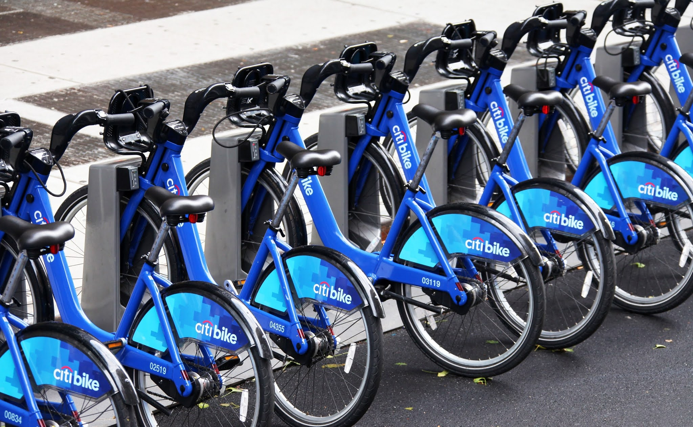
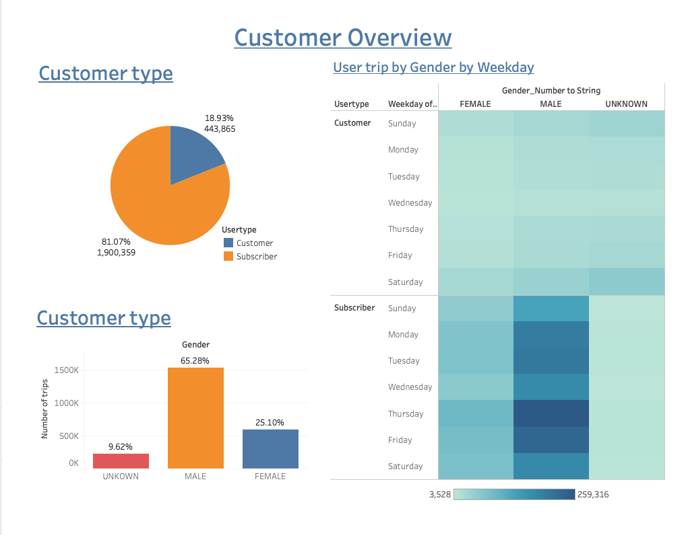
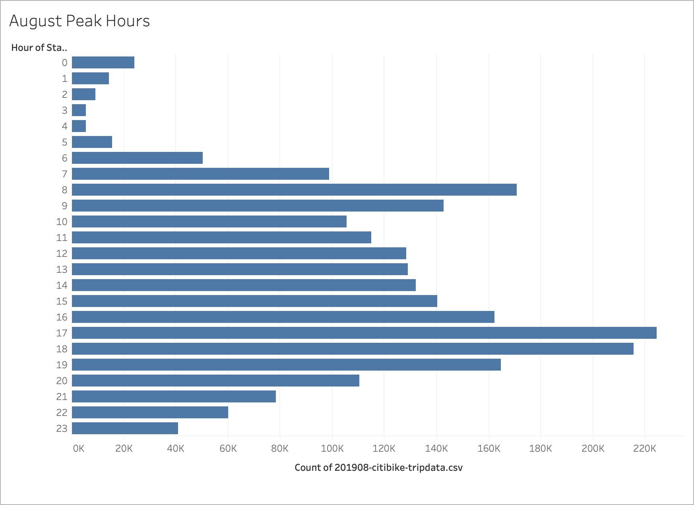
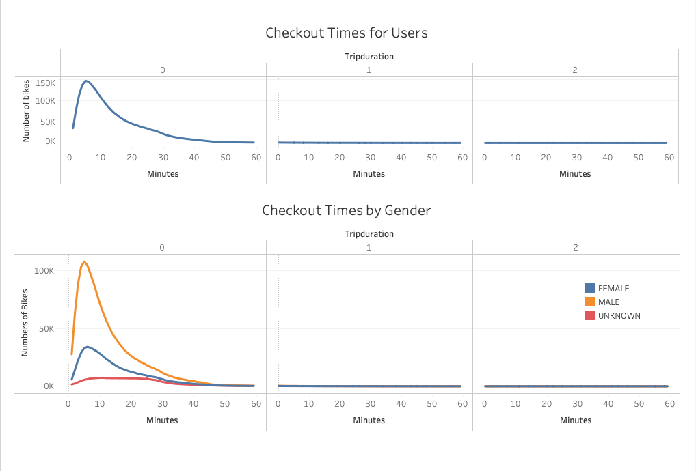
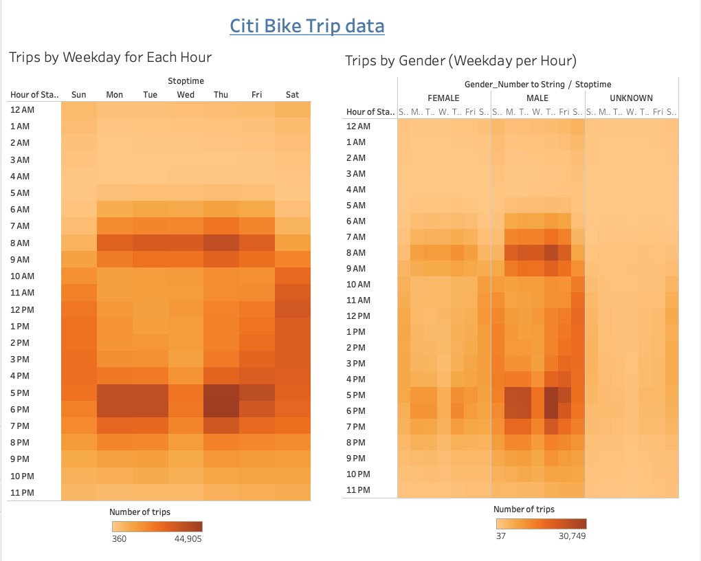
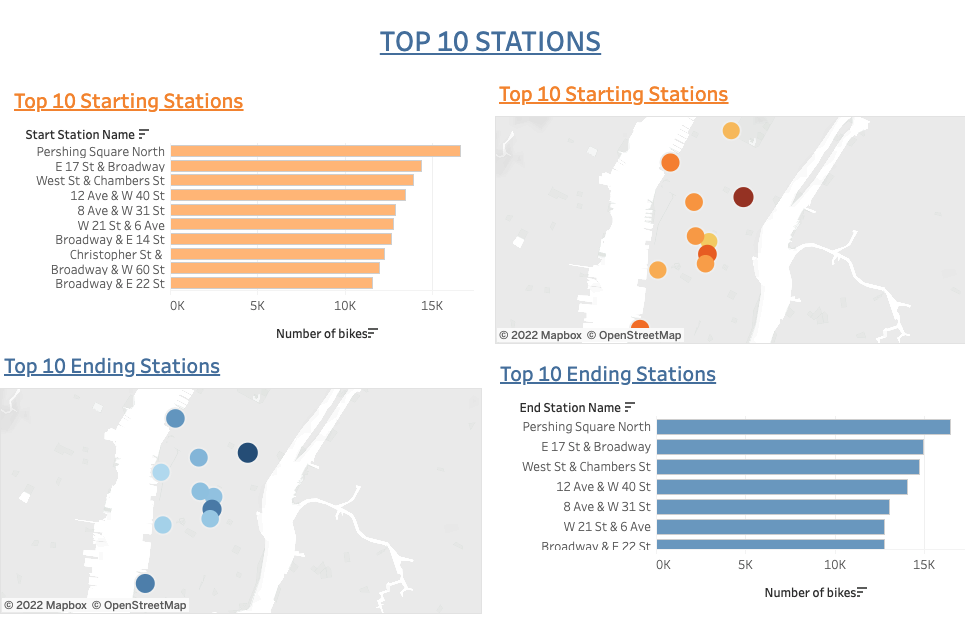
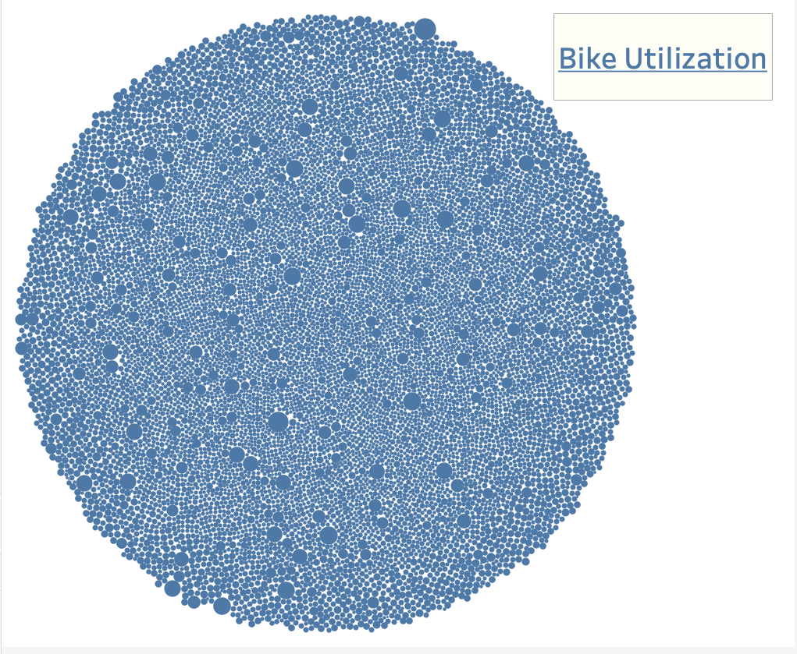
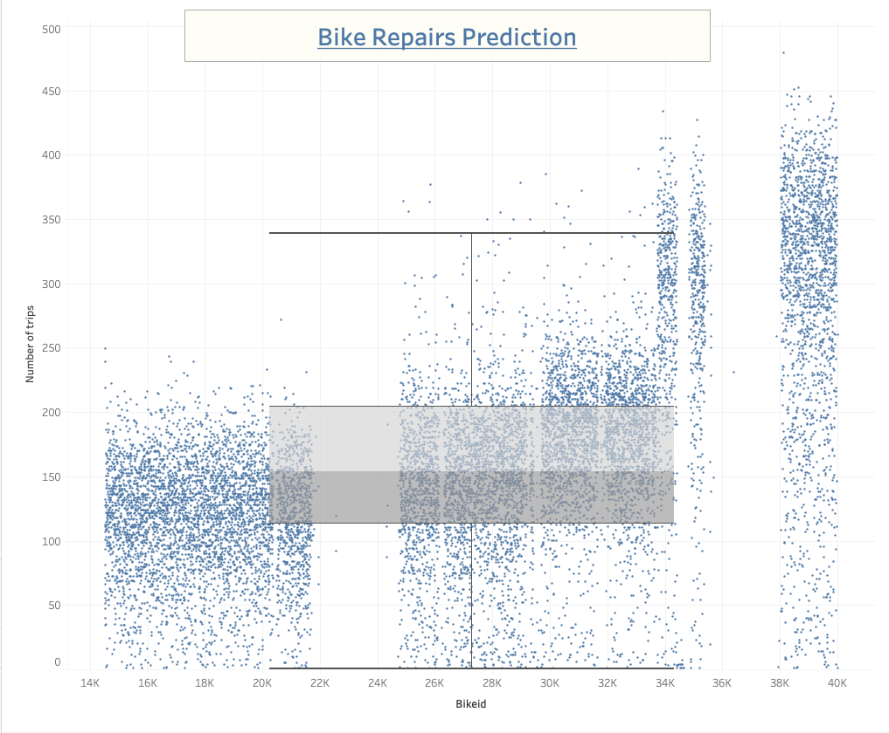

# Bike Sharing in Des Moines 
 

## Overview
The purpose of this project is to create a proposal on a bike sharing business in Des Moines. We take New York City as a case study to investigate how the biking sharing business works there. We use data from August because there is likely more traffic during the summer months.

For this analysis, we use Pandas to change the "tripduration" column from an integer to a datetime datatype. Then, using the converted datatype to create a set of visualizations to:

* Show the customer overview include breakdown of annual subscribers vs. short-term customers and gender
* Show the peak hours for bike rentals
* Show the length of time that bikes are checked out for all riders and genders
* Show the number of bike trips for all riders and genders for each hour of each day of the week, and
* Show the number of bike trips for each type of user and gender for each day of the week.

## Results

#### 1. <b>Customer overview :</b> CitiBike Analysis tells that more than 80% are Subscribers, with an nearly 19% are non-subscribers. Among those customers, 65% are male users while female users account for 25% General. Note that there are nearly 10% users in unknown gender, these might be non-subscribers users. Amount subscribers, the majority of users are male, and Thursday and Friday are days records the highest usage.

 

#### 2. <b>Peak hours for bike rentals:</b> 8-9am in the morning and 5-6 pm in the afternoon, since these are the time people go to work and go back home after work.
 

#### 3. <b>Checked out time for all riders and by gender :</b> Customers are most likely checked out the bike for less then an hour, the mode is less than 10 minutes in general. Female's checkout time is slightly longer than male's, but still mostly less then 20 minutes.
 

#### 4. <b>Number of bike trips for all riders and gender on each day:</b> customers mainly checkout bikes at 7-9am and 5-7pm on weekdays. On weekends, bikes are checkedout generally between 10am-7pm. Male customers are much more than the female customers. 
 

#### 5. <b>Top 10 Stations</b> : By studying the top starting and ending stations helps us to determine which type of locations, workplace or tourist spots or resturants, are the most popular locations, thus to better allocate the bikes
 

#### 6. <b>Bike Utilization</b> : The larger the circle size, the more the bike been checked out.
 

#### 7. <b>Bike Repair Predication</b> : The time of bikes being used higher than the upper whisker value (Q3+1.5xIQR) will be regarded as "outliers" in the bike utiloization map, and thus to be assumed they are exceesively used and attract maintenance attention.  
 

## Summary 
In citi bike analysis, most of the bike sharing customers are subscriber, it is suggested to improve the user experience to attract more subscribers. And introduce student promotion to acquire student subscriber users. Secondly, the checkedout time are  mainly the time before and after working hours， thus we suggest to put more bikes on popular locations at those time frames to ensure the supply. Thirdly, the customers generally checkesout bikes for less than 30 minutes, it shows Citi Bike has many stations in the city thus the riders can easily return the bike, which is a very good point for our Des Moines biking business to follow. 

In addition to the above, we can look into which stations are the most popular, is work place or tourist spot, in order to help us to determine the biking stations distribution. Besides, inventory and maintenance are issues that worth our further investigation.

[Link to dashboard](https://public.tableau.com/app/profile/yingying.cheung/viz/Des-Moines-Bike-Sharing_16521251816520/CitiBikeAnalysis-Aug2019?publish=yes "Link to dashboard")